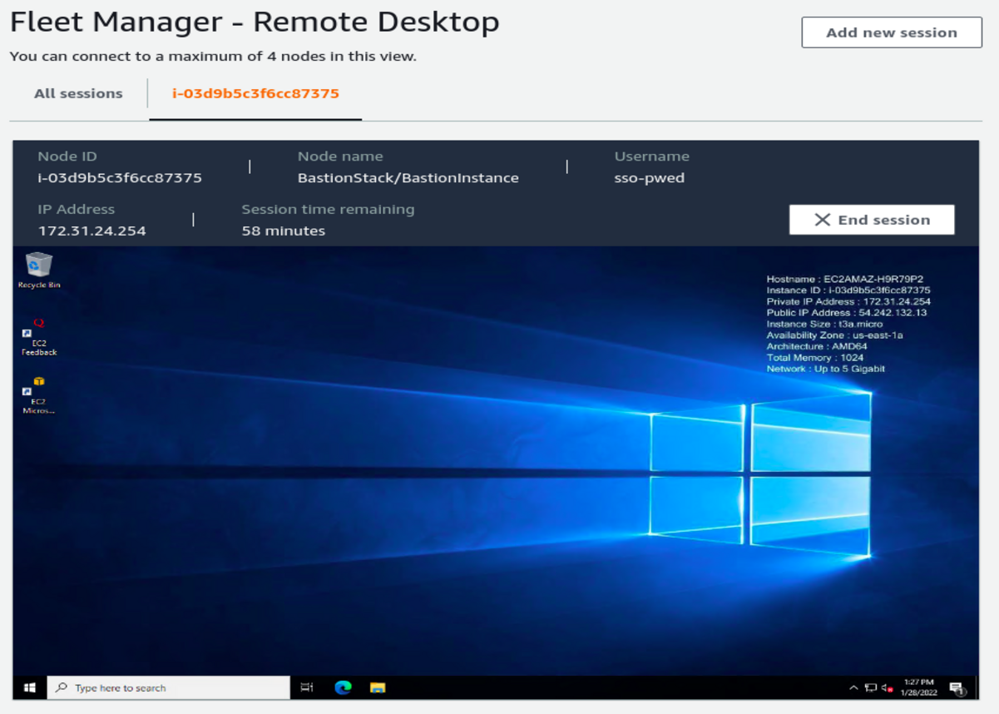

# Windows bastion with AWS SSO access

This template will deploy a Windows bastion server that can be accessed through Fleet Manager under Systems Manager using an SSO user

## Screenshot

## Wishlist

- [ ] Fill out readme
- [ ] Investigate an on demand tmp server model
  - [ ] Step function to time out the machine after 4h?
- [ ] Caveats
- [ ] Benifits
- [ ] Customer Use cases
- [ ] Potential alterations
